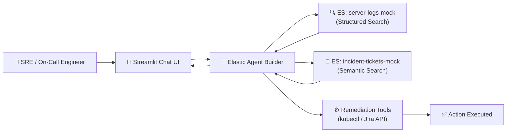

# 🚨 ElasticOnCall — The SRE / DevOps Resolution Agent

> Built for the **Elasticsearch Agent Builder Hackathon**

**ElasticOnCall** is a context-driven, multi-step AI agent that lives in your chat interface and takes over the painful process of incident triage.

When production goes down, on-call engineers waste 15-20 minutes hunting through logs and searching for past tickets. **ElasticOnCall automates this in seconds.**

## Architecture



## Features

| Feature | Description |
|---|---|
| 🔍 **Log Analysis** | Real-time structured search over `server-logs-mock` for errors, latency spikes |
| 🧠 **Contextual Memory** | Semantic search across historical tickets to find past incidents & resolutions |
| 💬 **Conversational UI** | Streamlit chat streaming the agent's tool calls and reasoning |
| 📊 **Live Metric Dashboard** | Inline metrics (latency, error rate, DB pool) rendered during investigation |
| ⚡ **1-Click Remediation** | Execute `kubectl` restarts, create Jira tickets, scale replicas from the chat |

## Quick Start

```bash
# 1. Clone and install
pip install -r requirements.txt

# 2. Set environment variables
cp .env.example .env
# Edit .env with your Elastic Cloud Serverless URL and API Key

# 3. Generate and ingest mock data
python scripts/generate_logs.py
python scripts/generate_tickets.py
python scripts/ingest_to_elastic.py

# 4. Run the UI
python -m streamlit run app/main.py
```

## Agent Builder Setup

Inside Kibana:
1. Create a **search tool** pointing to `server-logs-mock`
2. Create a **semantic search tool** pointing to `incident-tickets-mock`
3. Set system prompt: *"You are a Level 3 SRE. Correlate metrics with historical ticket resolutions."*

## Tech Stack

- **Elasticsearch Serverless** — Data storage and search
- **Elastic Agent Builder** — LLM orchestration with tools
- **Streamlit** — Real-time chat UI
- **Python** — Backend logic

---

*Built with ❤️ for the Elasticsearch Agent Builder Hackathon 2026*
